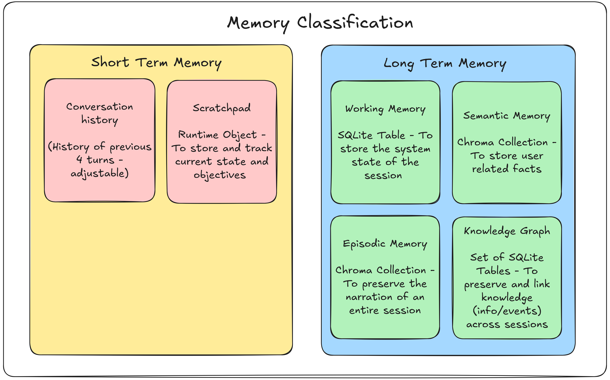
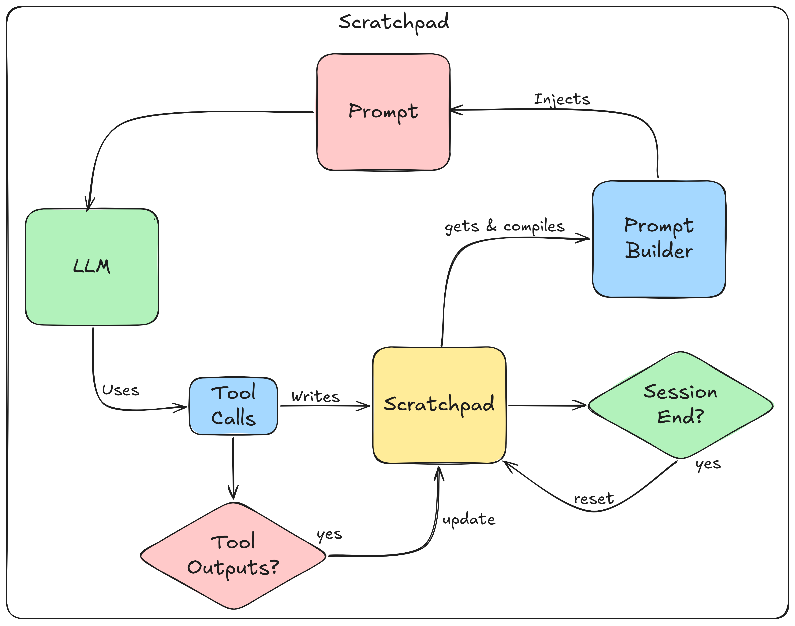
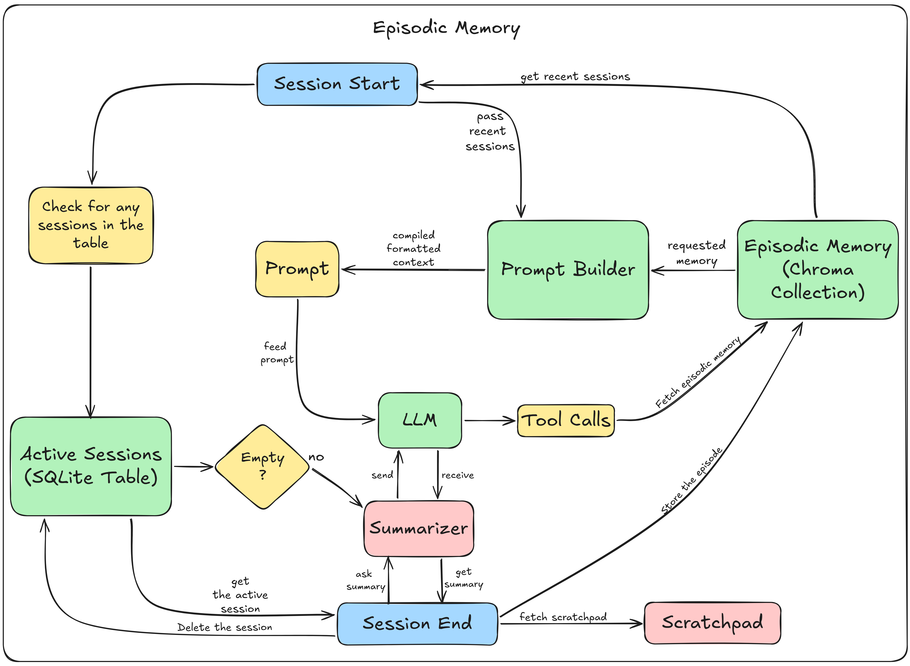
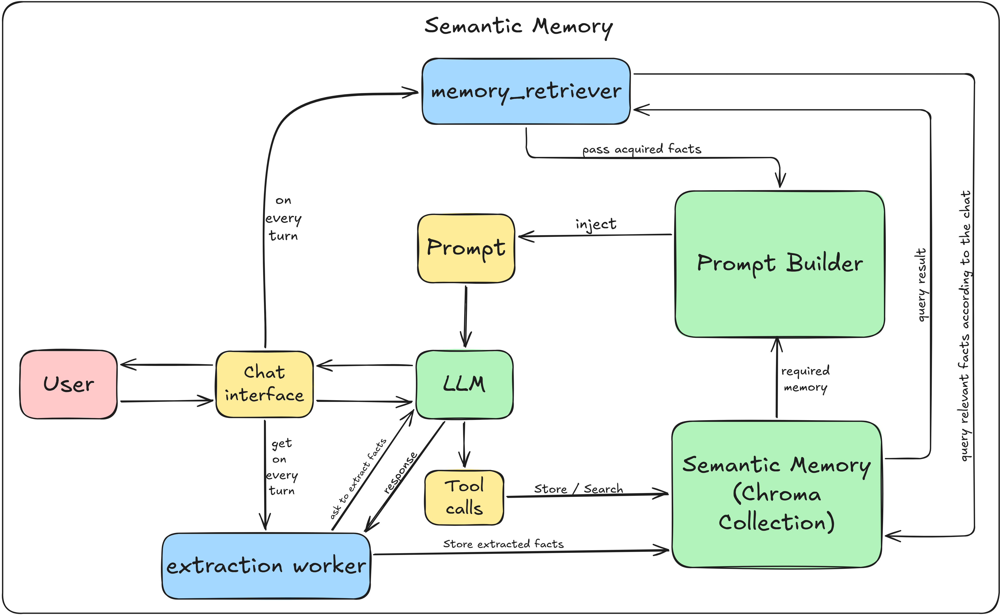
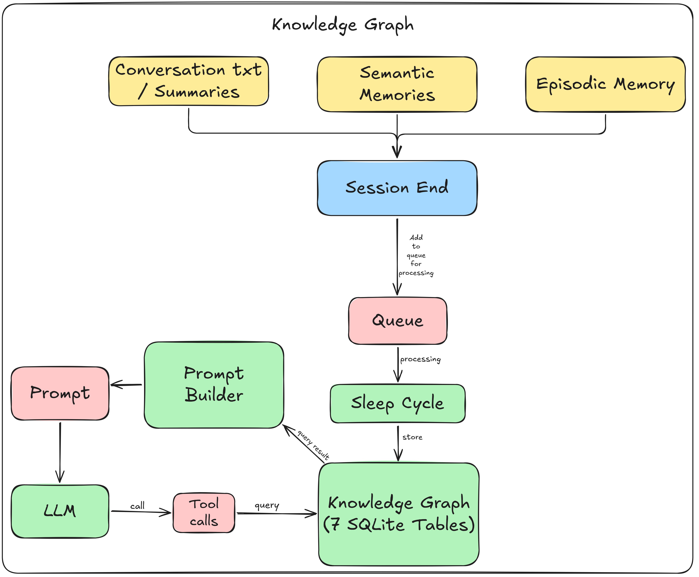

# SEVEN — Memory Architecture

SEVEN implements a six-layer cognitive memory architecture modeled on human memory systems. Each layer serves a distinct purpose, operates on a different timescale, and uses the storage backend best suited to its access pattern. The layers work together to give the assistant persistent awareness across sessions without flooding the context window on every turn.

The memory system is fully autonomous — facts are extracted, decayed, merged, and pruned without user intervention. The LLM can also explicitly read/write memory via tool calls, but the background workers handle the majority of memory maintenance silently.



---

## 1. Short-Term Memory (Scratchpad)

An in-memory "working notes" structure that tracks planning state, execution context, reflection notes, tool outputs, and memory update audit trails for the **current turn only**. Injected into every system prompt as the first context block. No disk persistence — resets completely at session start.

### How it works

The scratchpad is a singleton `Scratchpad` class holding structured state:

```
planning.current_goal       — what the user asked for this turn
planning.subtasks           — breakdown of the current goal
planning.completed_subtasks — subtasks finished so far
planning.current_step       — which subtask is in progress
tool_calls                  — audit trail of tools invoked this turn
memory_updates              — what facts were written/updated
retrieved_memories          — context seeded at session start
summary                     — free-text narrative summary
```

The LLM writes to the scratchpad via tool calls (`Tools/scratchpad_tool.py`). On every turn, `PromptBuilder` compiles the scratchpad into a formatted text block and injects it into the prompt as the highest-priority context source.



### Write path

```
LLM tool call → scratchpad_tool.update_scratchpad_state() → Scratchpad singleton
```

### Read path

```
PromptBuilder.build_dynamic_context()
  → memory_retriever.get_retrieved_context()
    → scratchpad.get_compiled_memory()
      → formatted text block injected into prompt
```

### Lifecycle

- Created at session start (`Scratchpad._initialize()`)
- Written to by LLM tool calls throughout the session
- Reset at session end (`scratchpad.reset()`)
- Never persists across sessions

### Key files

| File | Purpose |
|------|---------|
| `MemoryManagement/shortterm_memory/scratchpad.py` | `Scratchpad` class and singleton |
| `MemoryManagement/shortterm_memory/summarizer.py` | `compiled_scratchpad_memory()` — formats state into text |
| `Tools/scratchpad_tool.py` | LLM-facing tool bridge for reading/writing |


---

## 2. Working Memory

Durable, session-scoped, structured key-value facts stored in SQLite. Two sub-types share the same table:

- **Working memory entries**: facts the LLM needs to reference later in the same session (names, numbers, locations, decisions)
- **Reflection directives**: self-correction behavioral rules produced by the reflection worker, which persist cross-session and influence the prompt on every turn

### Schema

```sql
working_memory(
  id TEXT PRIMARY KEY,
  session_id TEXT,
  memory_type TEXT,          -- 'fact', 'reflection', 'session_summary', etc.
  key TEXT,
  value TEXT,                -- JSON
  priority REAL DEFAULT 0.5,
  relevance REAL DEFAULT 0.5,
  created_at TEXT,
  updated_at TEXT,
  expires_at TEXT,           -- TTL-based expiry
  source TEXT,
  tags TEXT,                 -- JSON list
  access_count INTEGER DEFAULT 0,
  last_accessed TEXT,
  active INTEGER DEFAULT 1
)
```


### Reflection directives

The reflection worker (`LLMEngine/reflection_worker.py`) produces up to 5 behavioral directives every 5 turns and at session end. Each directive is scored on 5 criteria:

| Criterion | Values |
|-----------|--------|
| scope | `session`, `project`, `user` |
| specificity | `narrow`, `general` |
| confidence | 0.0–1.0 |
| actionable | bool |
| novel | bool |

These map to an `expires_at` duration:

| Scope × Specificity | Base duration |
|---------------------|---------------|
| session + narrow | 7 days |
| session + general | 14 days |
| project + narrow | 45 days |
| project + general | 90 days |
| user + narrow | 90 days |
| user + general | 180 days |

Confidence < 0.4 halves the base duration. Non-actionable directives are capped at 14 days. Non-novel directives are capped at 7 days.

Reflections are visible on the **very next turn** — `PromptBuilder` does a live SQLite read every turn via `get_active_reflections_all_sessions(limit=5)`.

### Write path

```
LLM tool call → working_memory_tool.insert_working_memory()
  → working_memory_db_client.insert_working_memory()

Reflection worker → working_memory_db_client.insert_working_memory()
  (memory_type='reflection')

Session end → session_lifecycle._consolidate_reflections()
  → working_memory_tool.insert_working_memory()
  (memory_type='session_summary')
```

### Read path

```
PromptBuilder.build_dynamic_context()
  → working_memory_db_client.get_active_reflections_all_sessions(limit=5)
  → SELF-CORRECTION DIRECTIVES block injected into prompt

LLM tool call → working_memory_tool.get_working_memory()
  → working_memory_db_client.get_working_memory()
```

### Lifecycle

- Created with `expires_at = now + 60 days` (auto-refreshed on every update)
- Expired rows filtered out of all reads automatically
- Physical deletion via `MemoryManagement/working_memory/memory_lifecycle.py` at startup
- Reflection consolidation at session end: LLM classifies each directive as keep/delete/promote, then hard-deletes noise

### Key constants

| Constant | Value | Location |
|----------|-------|----------|
| `WORKING_MEMORY_TTL_DAYS` | 60 | `Database/working_memory_db_client.py:52` |
| `MAX_REFLECTION_DIRECTIVES` | 5 | `PromptBuilder/prompt_builder.py:64` |
| `_MIN_REFLECTIONS_TO_CONSOLIDATE` | 2 | `SessionManager/session_lifecycle.py:52` |

### Key files

| File | Purpose |
|------|---------|
| `Database/working_memory_db_client.py` | All CRUD operations |
| `MemoryManagement/working_memory/memory_lifecycle.py` | TTL expiry pruning |
| `Tools/working_memory_tool.py` | LLM-facing tool bridge |
| `LLMEngine/reflection_worker.py` | Background reflection generation |

---

## 3. Episodic Memory

Long-term memory of past conversation sessions — what was discussed, decided, alternatives considered, reasoning sequences. Stored as "episodes" (title + summary + metadata). Primary access pattern is semantic search ("what did we discuss about X").

### Schema (ChromaDB metadata)

```python
{
  "session_id": str,
  "title": str,
  "key_topics": list[str],
  "start_time_iso": str,
  "end_time_iso": str,
  "start_time_epoch": float,
  "end_time_epoch": float,
  "turn_count": int,
  "outcome": str,
  "related_semantic_memory_ids": list[str],
  "entities_mentioned": list[str],     # reserved
  "importance": float,
  "decay_count": int,
  "merged_from": list[str],
  "access_count": int,                 # reserved
  "last_accessed_epoch": float,
  "created_at_epoch": float
}
```

Embedded document text: `title + "\n" + summary`



### Write path

```
Clean session end:
  session_lifecycle.on_session_end()
    → episodic_summarizer.summarize_session()
    → episodic_memory_store.insert_episode()

Crash recovery:
  session_lifecycle._finalize_crashed_session()
    → episodic_summarizer.summarize_crashed()
    → episodic_memory_store.insert_episode()

Rolling chunk summaries:
  chunk_summary_worker → summarizer.summarize_chunk()
    → active_sessions_db_client.append_chunk_summary()
    (accumulated, used at session end)

Decay merge:
  memory_lifecycle._merge_batch()
    → summarizer.summarize_merge()
    → insert_episode() with higher decay_count
    → delete_episodes() on source rows
```

### Read path

```
LLM tool search:
  Tools/episodic_memory_tool.py → search_and_compile_episodic_context()
    → episodic_memory_store.search_episodes()  (semantic search)

Deterministic trigger:
  LLMEngine/episodic_trigger.py → regex pattern match on user query
    → same search_and_compile path

Session start passive seed:
  session_lifecycle → episodic_memory_store.get_recent_episodes_capped(2)

PromptBuilder:
  prompt_builder → episodic_trigger.maybe_get_episodic_context()
    → appended to retrieved context
```

### Lifecycle

- Created at session end with `decay_count=0`, `importance=0.5`
- Decay thresholds (escalating age by decay level):

| Decay level | Age threshold | Action |
|-------------|---------------|--------|
| 0 → 1 | 180 days (6 months) | Merge batch into summary |
| 1 → 2 | 365 days (12 months) | Merge again |
| 2+ → N+1 | 730 days (24 months) | Continue merging |

- Batch merge: 20 episodes at the same decay level merge into 1 summary row
- `access_count` bumps ONLY from explicit tool recall or deterministic trigger (never from passive seed)

### Key constants

| Constant | Value | Location |
|----------|-------|----------|
| `BATCH_SIZE` | 20 | `MemoryManagement/episodic_memory/memory_lifecycle.py:42` |
| `MAX_DECAY_LEVEL_SCANNED` | 6 | `MemoryManagement/episodic_memory/memory_lifecycle.py:48` |
| `MAX_FACTS_PER_EPISODE` | 5 | `Tools/episodic_memory_tool.py:33` |
| Passive seed cap | 2 episodes | `SessionManager/session_lifecycle.py:212` |

### Key files

| File | Purpose |
|------|---------|
| `MemoryManagement/episodic_memory/episodic_memory_store.py` | ChromaDB CRUD + filtered retrieval |
| `MemoryManagement/episodic_memory/summarizer.py` | All LLM-based summarization (4 entry points) |
| `MemoryManagement/episodic_memory/memory_lifecycle.py` | Decay-by-summarization |
| `LLMEngine/episodic_trigger.py` | Deterministic regex recall trigger |
| `Tools/episodic_memory_tool.py` | LLM-facing tool bridge |

---

## 4. Semantic Memory

Long-term, durable single facts about the user — identity, preferences, skills, goals, relationships, behavioral directives promoted from reflections. Atomized facts (one fact per row), not narrative text. Primary access is similarity search.

### Schema (ChromaDB metadata)

```python
{
  "importance": float,      # 0.0-1.0
  "category": str,          # identity, education, interests, goals,
                            # preferences, experience, relationships,
                            # other, behavioral_directive
  "polarity": str,          # positive, negative, neutral
  "source": str,
  "created_at": str,        # ISO
  "last_accessed": str,     # ISO
  "access_count": int
}
```


### Deduplication

The `store()` method has a two-stage deduplication pipeline:

1. **Near-identical** (cosine distance ≤ 0.08): bumps `access_count`, does NOT create a new entry
2. **Paraphrase range** (0.08–0.35): merges only if SAME category AND SAME polarity AND no negation mismatch

Negation detection prevents merging "User likes Python" with "User dislikes Python".

### Write path

```
Automatic extraction (every turn):
  extraction_worker → memory_extractor.extract_and_store_batch()
    → LLM call extracts 1-3 facts
    → semantic_memory.store() (with deduplication)

LLM tool call:
  Tools/semantic_memory_tool.py → semantic_memory.store()

Session-end promotions:
  session_lifecycle → semantic_memory.store()
  (goals, completed subtasks, memory updates, errors)

Reflection consolidation promotion:
  session_lifecycle → semantic_memory.store()
  (category='behavioral_directive')
```

### Read path

```
Per-turn prompt injection:
  memory_retriever → semantic_memory.retrieve_as_text(
    query, k=5, min_importance=0.4
  )
  (filtered by RELEVANCE_THRESHOLD=0.5 cosine distance)

LLM tool search:
  Tools/semantic_memory_tool.py → semantic_memory.retrieve()
  (bumps access_count)

Session start seed:
  session_lifecycle → retrieves goals and experience categories
```

### Lifecycle

- Created with initial `importance` from LLM extraction (0.0–1.0)
- Decay: `DECAY_FACTOR = 0.98` per 30-day cycle
  - Formula: `new_importance = current × (0.98 ^ cycles)` where `cycles = age_days // 30`
- Pruning:
  - Pass 1: delete anything with `importance < 0.15` unconditionally
  - Pass 2: if count > 500, delete lowest-scored until 400
  - Score formula: `(importance × 0.7) + (min(access_count, 10) / 10 × 0.3)`

### Key constants

| Constant | Value | Location |
|----------|-------|----------|
| `MAX_MEMORIES` | 500 | `MemoryManagement/semantic_memory/memory_lifecycle.py:25` |
| `PRUNE_TARGET` | 400 | `MemoryManagement/semantic_memory/memory_lifecycle.py:26` |
| `DECAY_FACTOR` | 0.98 | `MemoryManagement/semantic_memory/memory_lifecycle.py:27` |
| `DECAY_INTERVAL_DAYS` | 30 | `MemoryManagement/semantic_memory/memory_lifecycle.py:28` |
| `MIN_IMPORTANCE` | 0.15 | `MemoryManagement/semantic_memory/memory_lifecycle.py:29` |
| `RELEVANCE_THRESHOLD` | 0.5 | `MemoryManagement/semantic_memory/semantic_memory.py:260` |
| `MAX_SNIPPET_CHARS` | 6000 | `MemoryManagement/semantic_memory/memory_extractor.py:69` |

### Key files

| File | Purpose |
|------|---------|
| `MemoryManagement/semantic_memory/semantic_memory.py` | `SemanticMemory` class (singleton) |
| `MemoryManagement/semantic_memory/memory_extractor.py` | LLM-based fact extraction |
| `MemoryManagement/semantic_memory/memory_lifecycle.py` | Importance decay + pruning |
| `LLMEngine/extraction_worker.py` | Background batching worker |
| `Tools/semantic_memory_tool.py` | LLM-facing tool bridge |

---

## 5. Knowledge Graph

A structured relationship layer over the existing memory stack. It never duplicates memory content — it links concepts (nodes) to each other and back to the memories that support them. Enables "why do you think I use PostgreSQL?" type queries by tracing edges to evidence memories.

### Storage

7 SQLite tables in `data/seven_local.db`:

| Table | Purpose |
|-------|---------|
| `kg_nodes` | Canonical concept store (name, type, heading, importance, confidence) |
| `kg_edges` | Directed relationships between nodes (relation, confidence, weight, active flag) |
| `kg_node_aliases` | O(1) alias lookup index (alternative names, stored lowercase) |
| `kg_node_keywords` | Inverted keyword index over node name + heading words |
| `kg_memory_nodes` | Bidirectional links between ChromaDB memory IDs and graph nodes |
| `kg_graph_logs` | Append-only audit log of every graph mutation |
| `kg_sleep_queue` | Durable hand-off between session end and sleep pipeline |

### Node types

Person, Project, Technology, Organization, Place, Event, Concept

### Relation types (15)

| Relation | Symmetric | Description |
|----------|-----------|-------------|
| uses | No | One entity actively uses another as a tool, service, or resource |
| built_with | No | One entity was constructed using another as a component |
| depends_on | No | One entity requires another to function correctly |
| contains | No | One entity is a container or parent of another |
| created | No | One entity created another |
| replaced | No | One entity superseded another |
| part_of | No | One entity is a component of a larger entity |
| related_to | **Yes** | Two entities are connected but exact relationship is unclear |
| located_in | No | One entity is within another |
| knows | **Yes** | Two people or entities have a connection |
| worked_on | No | A person contributed work to a project |
| prefers | No | The user has a preference for one entity over alternatives |
| learned | No | A person acquired knowledge or skill |
| mentions | No | One entity references another without a stronger relationship |
| contradicts | **Yes** | One piece of knowledge conflicts with another |



### The Sleep Pipeline

The Knowledge Graph is populated by a background pipeline triggered by `/sleep`. It processes sessions one at a time through 6 steps:

```
┌─────────────────────┐
│  memory_selector    │  Pull pending sessions from kg_sleep_queue
│  (SessionBundle)    │  Hydrate with ChromaDB texts
└─────────┬───────────┘
          ↓
┌─────────────────────┐
│  entity_extractor   │  ONE background LLM call per session bundle
│  (ExtractionResult) │  Extracts entities + candidate relations
└─────────┬───────────┘
          ↓
┌─────────────────────┐
│  entity_resolver    │  Cascade match against existing graph:
│  (ResolutionResult) │  exact name → alias → keyword → create new
└─────────┬───────────┘
          ↓
┌─────────────────────┐
│  subgraph_retriever │  BFS from resolved nodes (1 hop, 15 nodes max)
│  (Subgraph)         │  Collects surrounding context
└─────────┬───────────┘
          ↓
┌─────────────────────┐
│  operation_proposer │  ONE background LLM call per batch
│  (ProposedOperation)│  Proposes minimum graph operations
└─────────┬───────────┘
          ↓
┌─────────────────────┐
│  validator          │  Deterministic validation (no LLM)
│  (ValidationResult) │  Checks node existence, duplicates, thresholds
└─────────┬───────────┘
          ↓
┌─────────────────────┐
│  _execute_valid_ops │  Writes edges, updates confidence, adds aliases
│  _link_memories     │  Links memories → nodes (kg_memory_nodes)
│  mark_processed     │  Stamps queue row
└─────────────────────┘
```

### Query Service (Phase 3)

4 candidate generation methods for retrieval:

| Method | Tier | Description |
|--------|------|-------------|
| `_search_exact_name` | 1 | Name prefix match |
| `_search_alias` | 1 | Exact alias lookup |
| `_search_keyword` | 2 | Inverted keyword index |
| `_search_semantic` | 2 | ChromaDB embedding similarity → memory-to-node links |

Tier-1 matches (exact identity) bypass RRF, sorted by `graph_prior`. Tier-2 matches are merged via Reciprocal Rank Fusion (RRF, k=60) + 25% `graph_prior` weight.

`graph_prior` formula: `0.4×importance + 0.3×confidence + 0.3×log(1+access+traversal)/log(51)`

### Key constants

| Constant | Value | Location |
|----------|-------|----------|
| `BATCH_SIZE` | 10 | `KnowledgeGraph/constants.py:44` |
| `MAX_BATCHES_PER_SLEEP` | 20 | `KnowledgeGraph/constants.py:49` |
| `MIN_ENTITY_CONFIDENCE` | 0.5 | `KnowledgeGraph/constants.py:53` |
| `MIN_EDGE_CONFIDENCE` | 0.6 | `KnowledgeGraph/constants.py:59` |
| `MERGE_CONFIDENCE_THRESHOLD` | 0.85 | `KnowledgeGraph/constants.py:66` |
| `SUBGRAPH_MAX_HOPS` | 1 | `KnowledgeGraph/constants.py:71` |
| `SUBGRAPH_MAX_NODES` | 15 | `KnowledgeGraph/constants.py:76` |
| `SUBGRAPH_MAX_EDGES_PER_NODE` | 5 | `KnowledgeGraph/constants.py:79` |
| `MAX_RETRIES` | 3 | `KnowledgeGraph/constants.py:82` |

### Key files

| File | Purpose |
|------|---------|
| `KnowledgeGraph/constants.py` | Pipeline tuning, prompts, relation metadata |
| `KnowledgeGraph/memory_selector.py` | Pulls pending sessions, hydrates bundles |
| `KnowledgeGraph/entity_extractor.py` | Step 1: LLM extracts entities |
| `KnowledgeGraph/entity_resolver.py` | Step 2: cascade match against graph |
| `KnowledgeGraph/subgraph_retriever.py` | Step 3: BFS subgraph around nodes |
| `KnowledgeGraph/operation_proposer.py` | Step 4: LLM proposes operations |
| `KnowledgeGraph/validator.py` | Step 5: deterministic validation |
| `KnowledgeGraph/sleep_scheduler.py` | Orchestrator, entry point |
| `KnowledgeGraph/kg_query_service.py` | Phase 3 retrieval (4 search methods + RRF) |

---

## 6. Active Sessions / Crash Recovery

Crash-durability marker and live scratch space for the current session. Survives crashes so interrupted sessions can be recovered on next startup.

### Schema

```sql
active_sessions(
  session_id TEXT PRIMARY KEY,
  started_at TEXT,
  last_turn_at TEXT,
  turn_count INT DEFAULT 0,
  status TEXT DEFAULT 'in_progress',
  chunk_summaries TEXT,              -- JSON list of rolling 5-turn summaries
  full_conversation TEXT,            -- JSON list of raw messages
  related_semantic_memory_ids TEXT   -- JSON list of ChromaDB memory IDs
)
```

### Write path

```
start_session()                → creates row (status='in_progress')
heartbeat()                    → bumps turn_count + last_turn_at (every turn)
save_full_conversation()       → overwrites raw messages (every turn)
append_chunk_summary()         → appends rolling summary (every 5 turns)
append_semantic_memory_id()    → records memory IDs as they're created
```

### Read path

```
Crash recovery:
  session_lifecycle._recover_stale_sessions()
    → finds rows still 'in_progress' from previous process
    → _finalize_crashed_session()
      → tries chunk_summaries first
      → falls back to full_conversation
      → falls back to related_semantic_memory_ids
      → creates episodic summary from whatever survived

Clean session end:
  session_lifecycle.on_session_end()
    → reads chunk_summaries, full_conversation, related_semantic_memory_ids
    → uses for episodic summary + KG sleep queue enqueue
```

### Lifecycle

- Created at session start, deleted at clean session end
- If `status='in_progress'` at next process startup = crashed session
- Crash recovery creates an episodic summary from whatever data survived
- Negligible sessions (turn_count < 1 with no recoverable data) are silently closed

### Key files

| File | Purpose |
|------|---------|
| `Database/active_sessions_db_client.py` | All CRUD operations |
| `SessionManager/session_memory_tracker.py` | Persists semantic memory IDs per session |
| `SessionManager/session_lifecycle.py` | Crash recovery sweep at startup |

---

## Cross-Cutting Workers

### Extraction Worker (`LLMEngine/extraction_worker.py`)

Batches conversation turns and flushes to semantic memory extraction. Queue + daemon thread with contextvars propagation.

- `MIN_EXTRACTION_INTERVAL = 30.0s` — minimum time between batch flushes
- `MAX_BATCH_WAIT = 90.0s` — maximum time before forced flush
- `flush_and_wait()` for orderly shutdown before LLM server stops

### Chunk Summary Worker (`LLMEngine/chunk_summary_worker.py`)

Every 5 turns, the last 5 turns are queued and summarized on a dedicated daemon thread. Writes to `active_sessions.chunk_summaries`. All LLM calls go through `llm_request_lock`.

### Reflection Worker (`LLMEngine/reflection_worker.py`)

Every 5 turns + session end, produces up to 5 behavioral directives. Written to `working_memory` as `memory_type='reflection'`. Visible on the very next turn via PromptBuilder's live SQLite read.

### History Manager (`LLMEngine/history_manager.py`)

Keeps last `MAX_HISTORY_TURNS = 4` user/assistant pairs + system message. Purely in-memory list; trimmed on every prompt build.

### Episodic Trigger (`LLMEngine/episodic_trigger.py`)

Deterministic regex patterns before the LLM sees the message. Patterns: "last time", "we discussed", "what did we", "continue from where we left off", etc. Fires → episodic context injected into prompt automatically.

---

## Prompt Assembly

`PromptBuilder/prompt_builder.py` assembles per-turn context:

```
1. Scratchpad compiled memory       (always included)
2. Semantic memory retrieval        (k=5, min_importance=0.4)
3. Episodic trigger                 (if query matches recall patterns)
4. Reflection directives            (top 5 cross-session reflections)
```

**Token budget**: `LOCAL_CTX_LIMIT = 12000` tokens

**Fallback order when over budget**:
1. Drop episodic context
2. Drop reflection directives
3. Replace semantic retrieval with empty-query fallback
4. Drop everything

---

## Memory Interconnection

```
                    ┌───────────────────┐
                    │    SCRATCHPAD     │  (in-memory, per-turn)
                    │   planning/state  │
                    └─────────┬─────────┘
                              │
              ┌───────────────▼───────────────┐
              │     memory_retriever.py       │  Assembles per-turn context
              └──┬──────────┬──────────┬──────┘
                 │          │          │
        ┌────────▼────┐ ┌───▼────────┐ ┌▼──────────────┐
        │  Semantic   │ │  Episodic  │ │  Reflections  │
        │  Memory     │ │  Memory    │ │ (working_mem) │
        │ (ChromaDB)  │ │ (ChromaDB) │ │  (SQLite)     │
        └──────┬──────┘ └─────┬──────┘ └──────┬────────┘
               │              │                │
               │  extraction_worker            │
               │  chunk_summary_worker         │ reflection_worker
               │  session_end_promotions       │
               │              │                │
               ▼              ▼                ▼
    ┌──────────┴──────────────┴────────────────┴─────────┐
    │              ACTIVE SESSIONS (SQLite)              │
    │   chunk_summaries / full_conversation /            │
    │   related_semantic_memory_ids                      │
    └───────────────────────┬────────────────────────────┘
                            │
                            ▼
              ┌─────────────▼─────────────┐
              │       KG_SLEEP_QUEUE      │  (SQLite, durable hand-off)
              │   episodic_memory_id      │
              │   semantic_memory_ids     │
              │   conversation_text       │
              └─────────────┬─────────────┘
                            │
              ┌─────────────▼─────────────┐
              │      SLEEP PIPELINE       │
              │   entity_extractor        │
              │   entity_resolver         │
              │   subgraph_retriever      │
              │   operation_proposer      │
              │   validator               │
              └─────────────┬─────────────┘
                            │
              ┌─────────────▼─────────────┐
              │     KNOWLEDGE GRAPH       │  (SQLite, 7 tables)
              │   kg_nodes                │
              │   kg_edges                │
              │   kg_node_aliases         │
              │   kg_node_keywords        │
              │   kg_memory_nodes  ◄──────┼── Links back to ChromaDB IDs
              │   kg_graph_logs           │
              └─────────────┬─────────────┘
                            │
                            ▼
              ┌─────────────▼─────────────┐
              │     KG Query Service      │  (Phase 3 retrieval)
              │   4 search methods        │
              │   RRF ranking             │
              └───────────────────────────┘
```
